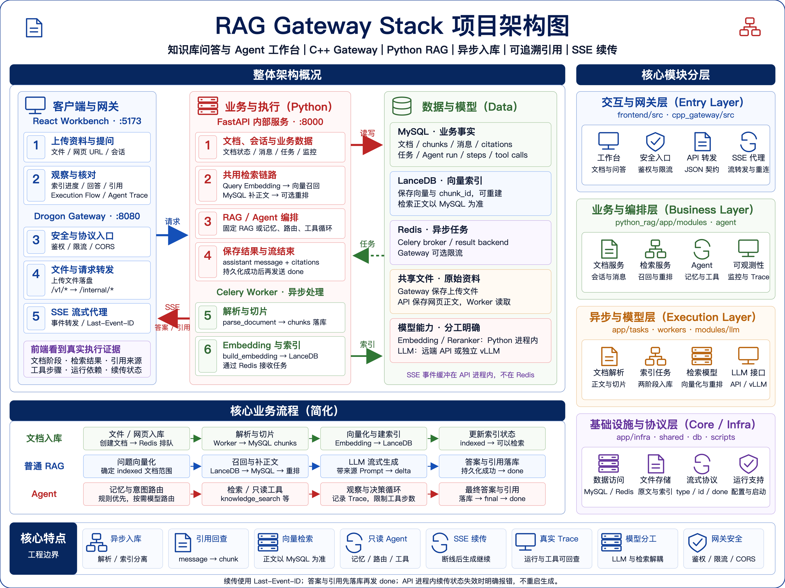

# 三分钟看懂 RAG Gateway Stack

这是一套支持文档入库、知识库问答和只读 Agent 工具调用的工程栈。前端既展示答案与引用，也展示索引进度和执行轨迹。

[查看高清 PNG（2880 × 2160）](./architecture-overview.png)，可直接用于项目介绍、分享或演示。

## 如何读这张图

- **左上：整体架构。** 浏览器通过 C++ Gateway 访问 FastAPI；Python 负责 RAG / Agent 业务，Celery Worker 执行异步入库。
- **右侧：核心模块分层。** 从交互与网关、业务与编排，到异步与模型、基础设施与协议，标出模块职责及所在目录。
- **左下：核心业务流程。** 分别展示文档入库、普通 RAG 和 Agent 的主要步骤。
- **底部：核心特点。** 汇总异步入库、引用回查、向量检索、只读 Agent、SSE 续传、Trace、模型分工和网关安全。

## 读图时需要知道的边界

MySQL 保存业务事实和 chunk 正文；LanceDB 保存可重建的向量索引，召回后通过 MySQL 补齐正文；Redis 用作任务 broker / result backend，以及 Gateway 的可选限流。图中的箭头展示主要调用方向，不穷举所有依赖。

文档解析与向量化是两个独立 Celery 任务。上传返回后，Worker 异步推进解析、切片、向量化和索引状态；前端通过文档与任务接口查询进度。Embedding 在 Python 进程内运行，Reranker 按配置执行，LLM 使用远端 API 或独立 vLLM。

普通 RAG 沿固定检索链路生成答案。Agent 增加记忆、意图路由和有步数上限的只读工具循环；路由规则未命中时再调用模型，知识库问题先执行 `knowledge_search`，通用或纯元数据问题进入无需检索的 Agent 分支，路由失败时按降级策略处理。

普通 RAG 在生成过程中逐步发送 `delta`。当前 Agent 会实时发送执行事件，最终答案完成并持久化后再发送答案 `delta`、`final` 和 `done`；图中的 Agent 流程不代表逐 token 输出。

两种 SSE 入口都先保存答案和引用，再发送 `done`；失败以 `error` 结束。客户端断开后生成继续，重连携带同一次运行的标识和 `Last-Event-ID`，只重放后续事件。**续传状态保存在 API 进程内**：完成流默认保留 15 分钟，且受完成流数量上限约束；过期、被清理或因 API 重启丢失后，续传明确失败，不重新生成。

## 从图找到代码

| 图中的组件 / 流程 | 主要代码入口 |
| --- | --- |
| 前端与流式客户端 | [工作台](../frontend/src/pages/workspace/WorkspacePage.tsx)、[Chat 客户端](../frontend/src/services/chatService.ts) |
| Gateway 路由与上传 | [网关入口](../cpp_gateway/src/main.cc)、[文件处理](../cpp_gateway/src/handlers/DocumentHandler.cc) |
| Python HTTP 入口 | [FastAPI](../python_rag/app/main.py)、[routers](../python_rag/app/api/v1/routers/) |
| 两阶段文档入库 | [Celery 索引任务](../python_rag/app/tasks/index_tasks.py)、[入库服务](../python_rag/app/modules/ingest/service.py) |
| 共用检索链路 | [检索服务](../python_rag/app/modules/retrieval/service.py) |
| 普通 RAG 与落库 | [流式生成](../python_rag/app/modules/chat/streaming_service.py)、[结果持久化](../python_rag/app/modules/chat/stream_persistence.py) |
| Agent 路由与工具循环 | [意图路由](../python_rag/app/agent/intent_router.py)、[Agent Runner](../python_rag/app/agent/agent_runner.py)、[本地工具](../python_rag/app/agent/tools/local/) |
| SSE 缓冲与续传 | [Chat 续传](../python_rag/app/modules/chat/resumable_stream.py)、[Agent 流](../python_rag/app/agent/streaming/agent_streaming_service.py) |

启动与部署参数见[根 README](../README.md#如何在本地启动)，接口细节见 [Agent API](./api_agent.md)。
