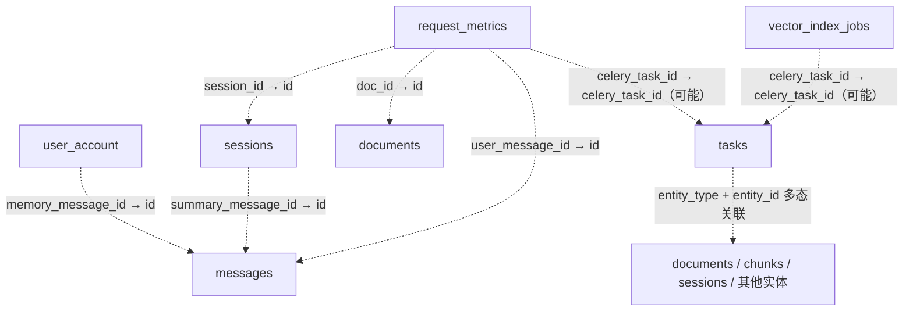

# 数据库关系

## 实体关系图

```mermaid
erDiagram
    USER_ACCOUNT {
        BIGINT id PK
        VARCHAR username UK
        TEXT memory_summary
        BIGINT memory_message_id
        TIMESTAMP memory_updated_at
        TIMESTAMP created_at
    }

    DOCUMENTS {
        BIGINT id PK
        BIGINT user_id FK "组合唯一键之一"
        VARCHAR filename
        VARCHAR mime
        CHAR sha256 "与 user_id 组合唯一"
        BIGINT size_bytes
        VARCHAR storage_path
        VARCHAR status
        VARCHAR index_status
        TEXT error_message
        TIMESTAMP created_at
        TIMESTAMP updated_at
    }

    DOC_CHUNKS {
        BIGINT id PK
        BIGINT doc_id FK "组合唯一键之一"
        INT chunk_index "与 doc_id 组合唯一"
        LONGTEXT text
        INT tokens_est
        VARCHAR embedding_status
        VARCHAR vector_index_status
        TIMESTAMP created_at
    }

    DOCUMENT_INDEXES {
        BIGINT id PK
        BIGINT doc_id FK,UK
        VARCHAR index_type
        VARCHAR embedding_model
        INT dimension
        VARCHAR index_path
        VARCHAR mapping_path
        INT chunk_count
        VARCHAR status
        TIMESTAMP created_at
        TIMESTAMP updated_at
    }

    VECTOR_INDEX_JOBS {
        BIGINT id PK
        BIGINT doc_id FK
        VARCHAR celery_task_id
        VARCHAR provider
        VARCHAR status
        INT chunk_count
        TEXT error_message
        JSON meta_json
        TIMESTAMP created_at
        TIMESTAMP updated_at
    }

    TASKS {
        BIGINT id PK
        VARCHAR celery_task_id UK
        VARCHAR type
        VARCHAR entity_type
        BIGINT entity_id
        VARCHAR state
        INT progress
        JSON meta_json
        TEXT error
        TIMESTAMP created_at
        TIMESTAMP updated_at
    }

    SESSIONS {
        BIGINT id PK
        BIGINT user_id FK
        VARCHAR title
        TEXT summary
        BIGINT summary_message_id
        TIMESTAMP created_at
        TIMESTAMP updated_at
    }

    MESSAGES {
        BIGINT id PK
        BIGINT session_id FK
        VARCHAR role
        LONGTEXT content
        VARCHAR status
        JSON meta_json
        TIMESTAMP created_at
        TIMESTAMP updated_at
    }

    CITATIONS {
        BIGINT id PK
        BIGINT message_id FK
        BIGINT doc_id FK
        BIGINT chunk_id FK
        INT chunk_index
        DOUBLE score
        TEXT snippet
        TIMESTAMP created_at
    }

    REQUEST_METRICS {
        BIGINT id PK
        VARCHAR request_type
        VARCHAR channel
        VARCHAR status
        BIGINT session_id
        BIGINT doc_id
        BIGINT user_message_id
        VARCHAR celery_task_id
        INT top_k
        INT ttft_ms
        INT e2e_latency_ms
        INT ready_latency_ms
        INT retrieval_ms
        INT prompt_tokens
        INT completion_tokens
        INT embedding_tokens
        DECIMAL cost_usd
        INT citation_count
        TINYINT no_context
        TINYINT timed_out
        VARCHAR context_mode
        VARCHAR answer_source
        TEXT error_message
        JSON extra_json
        TIMESTAMP created_at
    }

    AGENT_RUNS {
        BIGINT id PK
        VARCHAR trace_id
        VARCHAR agent_name
        VARCHAR agent_version
        VARCHAR model
        VARCHAR status
        BIGINT session_id FK
        BIGINT user_message_id FK
        JSON input_json
        JSON output_json
        JSON meta_json
        INT total_steps
        INT total_tool_calls
        INT prompt_tokens
        INT completion_tokens
        INT total_tokens
        DECIMAL cost_usd
        TEXT error_message
        TIMESTAMP started_at
        TIMESTAMP finished_at
        TIMESTAMP created_at
        TIMESTAMP updated_at
    }

    AGENT_STEPS {
        BIGINT id PK
        BIGINT run_id FK
        INT step_index
        VARCHAR step_type
        VARCHAR name
        VARCHAR status
        VARCHAR model
        JSON input_json
        TEXT reasoning_summary
        TEXT decision
        JSON output_json
        INT prompt_tokens
        INT completion_tokens
        INT total_tokens
        INT latency_ms
        TEXT error_message
        TIMESTAMP started_at
        TIMESTAMP finished_at
        TIMESTAMP created_at
        TIMESTAMP updated_at
    }

    AGENT_TOOL_CALLS {
        BIGINT id PK
        BIGINT run_id FK
        BIGINT step_id FK
        VARCHAR tool_call_id
        VARCHAR tool_name
        VARCHAR status
        JSON arguments_json
        JSON result_json
        TEXT result_preview
        INT latency_ms
        TEXT error_message
        TIMESTAMP started_at
        TIMESTAMP finished_at
        TIMESTAMP created_at
        TIMESTAMP updated_at
    }

    USER_ACCOUNT ||--o{ DOCUMENTS : "拥有 / CASCADE"
    USER_ACCOUNT ||--o{ SESSIONS : "创建 / CASCADE"

    DOCUMENTS ||--o{ DOC_CHUNKS : "拆分 / CASCADE"
    DOCUMENTS ||--o| DOCUMENT_INDEXES : "本地索引 / CASCADE"
    DOCUMENTS ||--o{ VECTOR_INDEX_JOBS : "索引任务 / CASCADE"
    DOCUMENTS ||--o{ CITATIONS : "被引用 / CASCADE"

    SESSIONS ||--o{ MESSAGES : "包含 / CASCADE"

    MESSAGES ||--o{ CITATIONS : "产生引用 / CASCADE"
    DOC_CHUNKS ||--o{ CITATIONS : "引用来源 / CASCADE"

    SESSIONS o|--o{ AGENT_RUNS : "运行会话 / SET NULL"
    MESSAGES o|--o{ AGENT_RUNS : "触发消息 / SET NULL"

    AGENT_RUNS ||--o{ AGENT_STEPS : "执行步骤 / CASCADE"
    AGENT_STEPS ||--o{ AGENT_TOOL_CALLS : "工具调用 / CASCADE"

```

## 非外键逻辑关联

```mermaid
flowchart TB
    UA["user_account"] -. "memory_message_id → id" .-> M["messages"]
    S["sessions"] -. "summary_message_id → id" .-> M

    RM["request_metrics"] -. "session_id → id" .-> S
    RM -. "doc_id → id" .-> D["documents"]
    RM -. "user_message_id → id" .-> M
    RM -. "celery_task_id → celery_task_id（可能）" .-> T["tasks"]

    VJ["vector_index_jobs"] -. "celery_task_id → celery_task_id（可能）" .-> T
    T -. "entity_type + entity_id 多态关联" .-> E["documents / chunks / sessions / 其他实体"]
```
